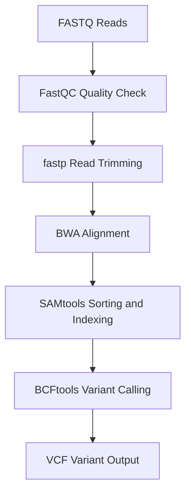

# NGS Variant Calling Pipeline

This project demonstrates a simple Next Generation Sequencing (NGS) variant calling workflow.

## Tools Used
FastQC  
fastp  
BWA  
SAMtools  
BCFtools  

## Workflow

FASTQ → Quality Control → Trimming → Alignment → Variant Calling

## Reference Genome
Escherichia coli (E. coli)

## Output
Variant file generated in VCF format.

## Project Structure

alignment/
data/
qc/
reference/
trimmed/
variants/

## Workflow Diagram

